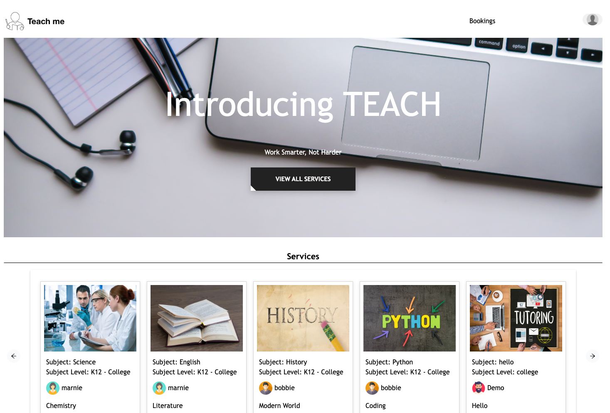

Description

A tutoring service that allows students to get taught anywhere around the world. [https://teach-me-6um4.onrender.com/]


2. Install dependencies

      ```bash
      pipenv install -r requirements.txt
      ```

3. Create a **.env** file based on the example with proper settings for your
   development environment

4. Make sure the SQLite3 database connection URL is in the **.env** file

5. This starter organizes all tables inside the `flask_schema` schema, defined
   by the `SCHEMA` environment variable.  Replace the value for
   `SCHEMA` with a unique name, **making sure you use the snake_case
   convention**.

6. Get into your pipenv, migrate your database, seed your database, and run your Flask app

   ```bash
   pipenv shell
   ```

   ```bash
   flask db upgrade
   ```

   ```bash
   flask seed all
   ```

   ```bash
   flask run
   
   ```Built With
   HTML5
   CSS
   Javascript
   Python
   Flask
   React
   Node.js
   SQLite
   NPM
   Git
   Github

7. To run the React App in development, checkout the [README](./react-app/README.md) inside the `react-app` directory.


